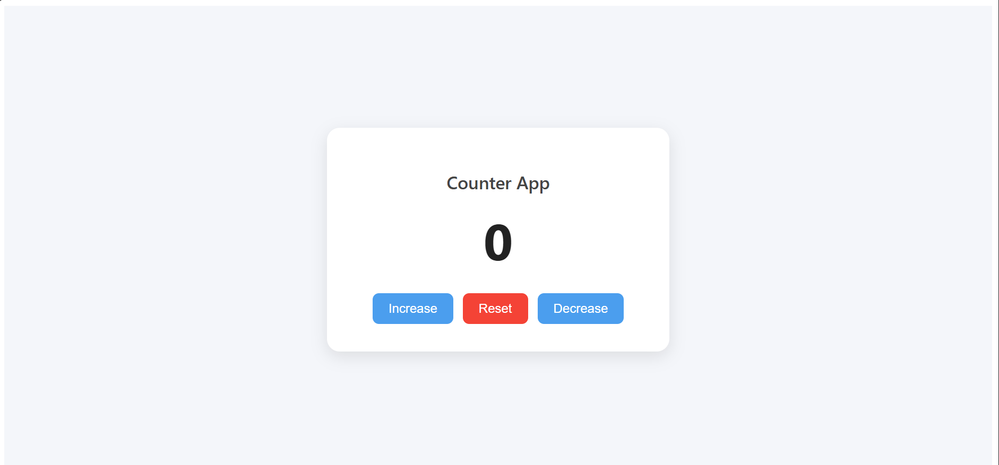

# Counter App

A simple **React** application to increase, decrease, or reset a counter value. This project is perfect for beginners to understand **React state management** using hooks (`useState`) and basic styling with CSS.

---

## Demo

---

## Features

- **Increase** the counter by 1
- **Decrease** the counter by 1
- **Reset** the counter to 0
- Smooth **hover effects** on buttons
- Clean and minimal **card-style UI**
- Responsive and modern design

---

## Built With

- React.js – Frontend library
- HTML5 & CSS3 – Markup and styling
- JavaScript (ES6+) – Application logic

---

