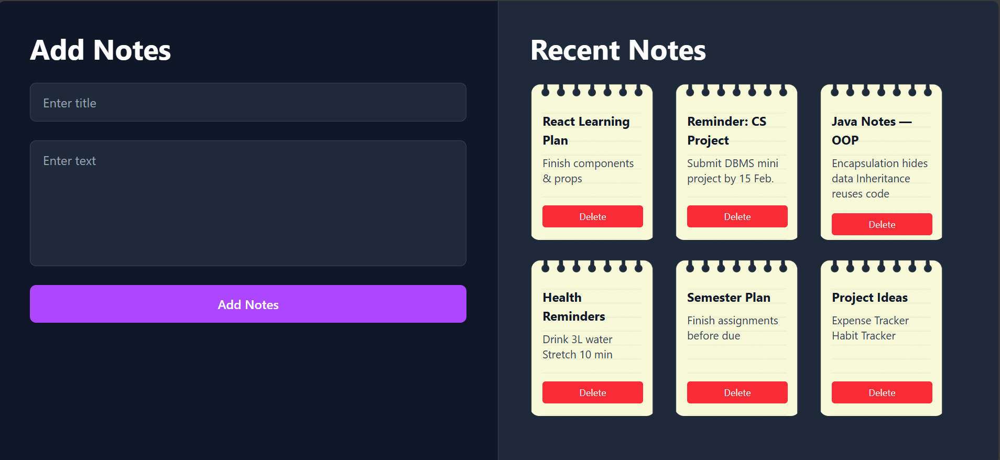

# Notes App

A simple **React Notes Application** that lets users create, store, and delete notes. This project is ideal for beginners learning **form handling**, **two-way binding**, and **component state management** in React.

---

## 📝 Demo Preview

---

## ✨ Features

- Create new notes with **title & content**
- **Two-way data binding** for inputs
- **Form handling** using `useState`
- Delete existing notes instantly
- Clean, responsive interface

---

## 🛠️ Built With

- **React.js** — UI library
- **HTML5 & CSS3** — UI layout & styling
- **JavaScript (ES6+)** — Logic handling

---

