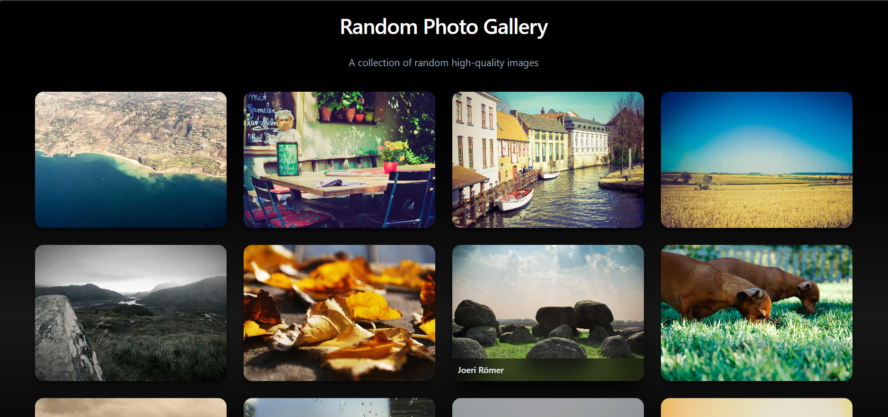
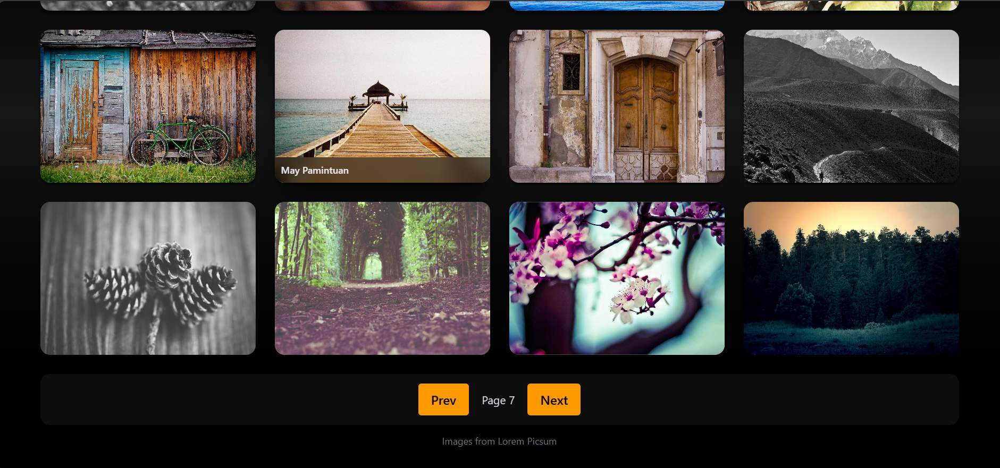

# 🖼️ Random Photo Gallery

A modern **React gallery app** that fetches random images from [Lorem Picsum](https://picsum.photos/) API.  
Includes **premium card design**, **hover effects**, **fade animations**, **skeleton loading**, and a **modal image viewer**. Perfect for your portfolio or practicing React & Tailwind CSS.

---

## 🌟 Features

- **Dynamic Image Loading**: Fetches images from the Picsum Photos API.  
- **Responsive Grid**: Works on mobile, tablet, and desktop screens.  
- **Premium Card Design**:
  - Smooth hover zoom effect  
  - Shadow and depth animations  
  - Author overlay on hover  
- **Skeleton Loader**: Animated placeholders while images load.  
- **Fade-in Animation**: Smooth appearance of images.  
- **Modal Viewer**: Click on any image to see a fullscreen modal with dark backdrop.  
- **Pagination**: Navigate between pages of images.  
- **Dark Theme**: Clean, modern dark UI with gradient and blur effects.

---

## 🚀 Demo

---

## 🛠️ Tech Stack

- **React** (functional components & hooks)  
- **Tailwind CSS** for styling  
- **Axios** for API requests  
- **Picsum Photos API** for random images

---

## 📂 Project Structure

