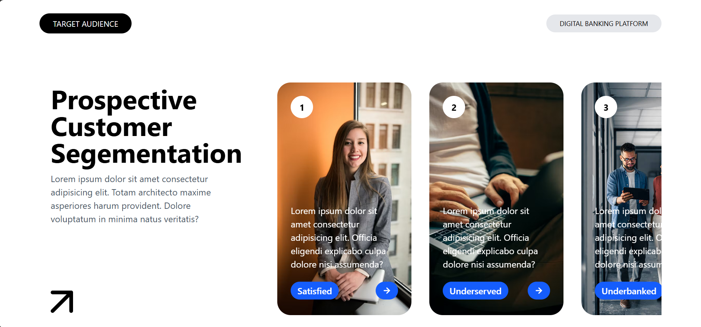

# 📊 Prospective Customer Segmentation UI

This project is a React-based UI demonstrating a modern card layout.
This is part of my React learning journey and showcases UI composition and styling techniques.

---

## 🚀 Features

- Modern & clean user interface
- Segmentation tags (Satisfied, Underserved, Underbanked)
- Reusable components
- Beginner-friendly code structure

---

## 🛠 Tech Stack

- React.js
- JavaScript (ES6+)
- HTML5
- Tailwind CSS

---

## 📸 Screenshot

---

## 🎯 Learning Outcomes

- Component-based UI development
- Code organization in React
- UI/UX layout practices

---

